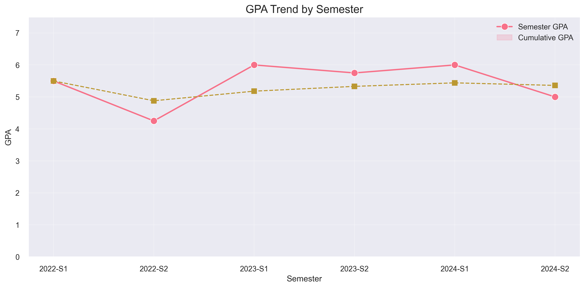
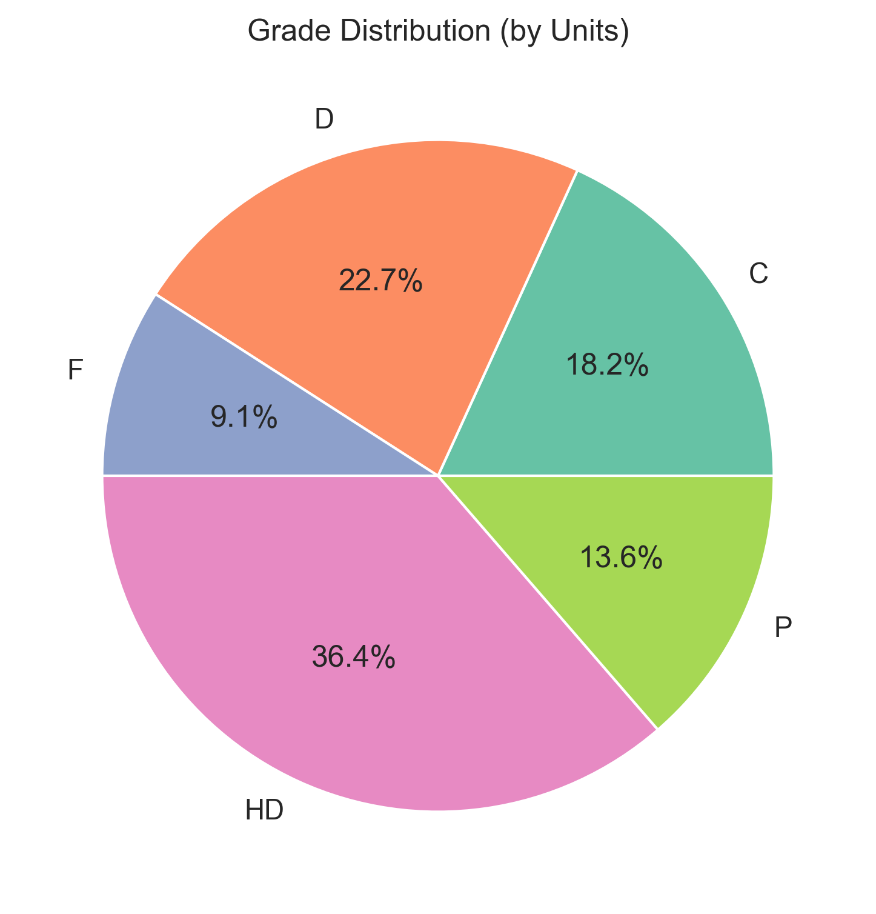
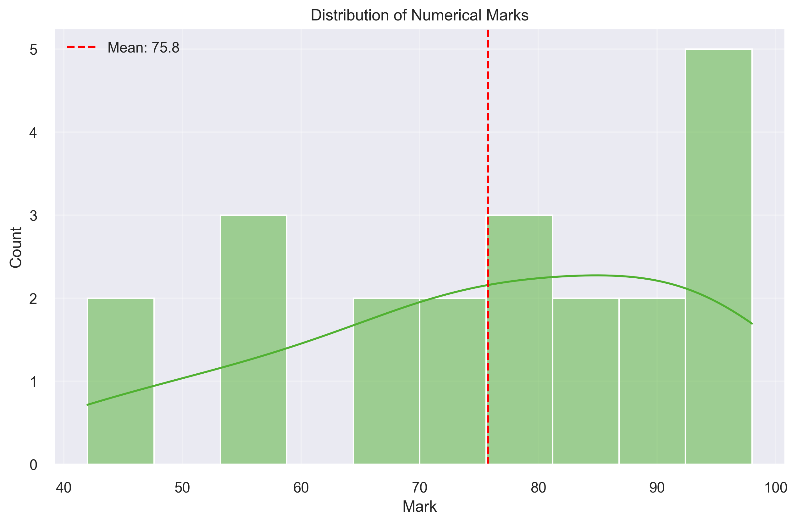
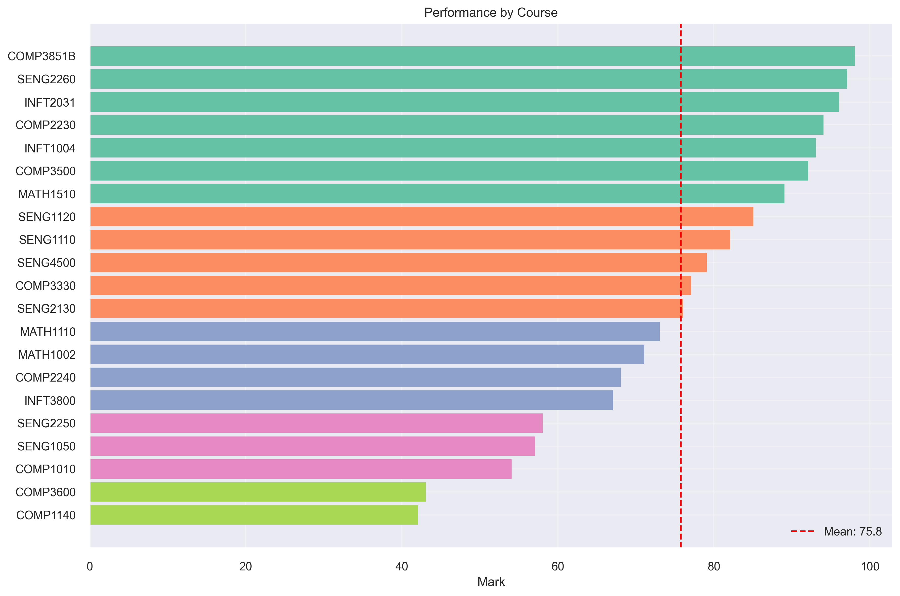
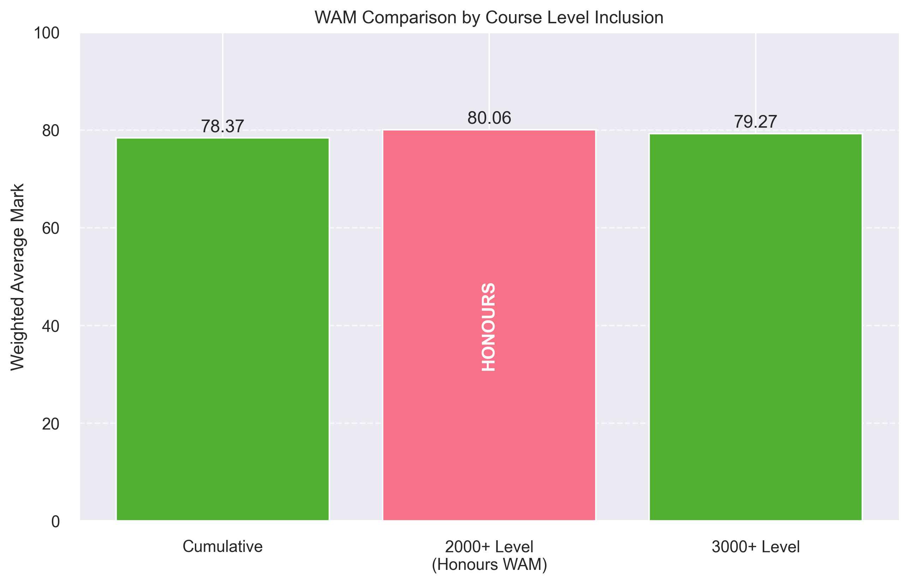
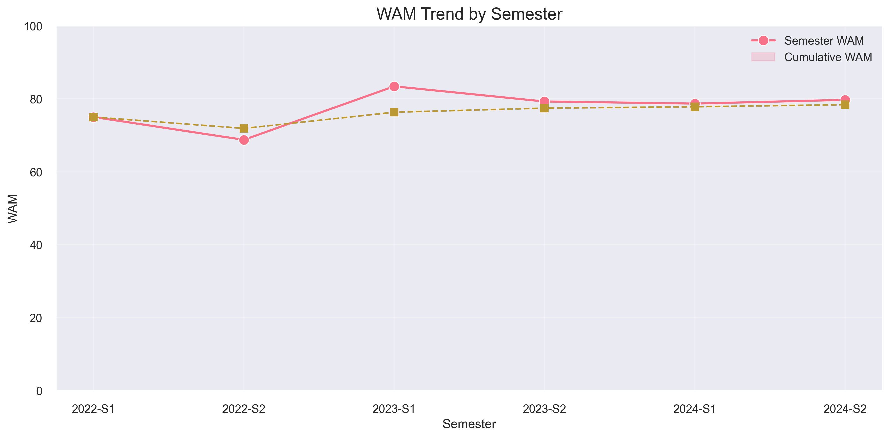

# GPA and WAM Calculator

A Python tool for visualising academic performance and calculating GPAs and WAMs from CSV grade data, designed for the University of Newcastle grading system: https://www.newcastle.edu.au/current-students/study-essentials/assessment-and-exams/results/gpa-calculator

## Features

### GPA Calculator
- 📊 Calculate overall GPA using a 7-point scale
- 📈 Visualise GPA trends across semesters
- 🥧 Generate grade distribution charts
- 📉 Analyse mark distributions
- 📋 View detailed course performance breakdowns

### WAM Calculator
- 🎓 Calculate Honours WAM by default (2000+ level courses)
- 📊 Additional WAM calculations for reference:
  - Cumulative WAM (all courses)
  - Level-specific WAM (e.g., 3000+ level courses)
- 📈 Track WAM trends across semesters
- 📉 View mark distribution with WAM thresholds
- 📋 See detailed course-by-course breakdown

## What is WAM?

A Weighted Average Mark (WAM) is the average mark achieved across all completed units in a program, weighted according to unit value and academic level. Unlike the GPA, which uses grade points, WAM uses the actual percentage marks and applies weighting based on course levels.

The Honours WAM (used for determining honours classification) is calculated using only 2000+ level courses with the following weightings:
- 2000 level courses: Weight = 2
- 3000 level courses: Weight = 3
- 4000/5000/6000 level courses: Weight = 4

## Screenshots

### GPA Trend


### Grade Distribution


### Mark Distribution


### Course Performance


### WAM Comparison


### WAM Trend


## Installation

### Prerequisites

- Python 3.8 or higher
- pip (Python package installer)

### Option 1: Quick Setup (Recommended)

#### On Windows:

```bash
# Clone the repository
git clone https://github.com/swazau/UON_GPA.git
cd UON_GPA

# Run the setup script
setup.bat
```

#### On macOS/Linux:

```bash
# Clone the repository
git clone https://github.com/swazau/UON_GPA.git
cd UON_GPA

# Make the setup script executable
chmod +x setup.sh

# Run the setup script
./setup.sh
```

### Option 2: Manual Setup

```bash
# Clone the repository
git clone https://github.com/swazau/UON_GPA.git
cd UON_GPA

# Create a virtual environment
python -m venv venv

# Activate the virtual environment
# On Windows:
venv\Scripts\activate
# On macOS/Linux:
source venv/bin/activate

# Install dependencies
pip install -r requirements.txt
```

## Usage

### Prepare Your Data

Create a CSV file with your grade data. The file should include the following columns:

- `semester`: Academic term (e.g., '2023-S1')
- `course_code`: Course identifier (e.g., 'COMP1010')
- `grade`: Letter grade (HD, D, C, P, F, UP)
- `mark`: Numerical score (0-100)
- `units`: Credit units for the course
- `class_title`: Full name of the course

You can use `samplegrades.csv` as a template. The easiest way to do this is just put your unofficial transcript and my template into ChatGPT, and it will reformat it correctly.

### Run the Programs

To calculate GPA with the default `samplegrades.csv` file:

```bash
python main.py
```

To calculate WAM with the default `samplegrades.csv` file:

```bash
python wam.py
```

To specify a different CSV file:

```bash
python main.py your_grades_file.csv
python wam.py your_grades_file.csv
```

### Output

#### GPA Program Output
The program generates:
1. Detailed GPA calculations in the console
2. Four visualisation files:
   - `grade_distribution.png`: Pie chart showing grade distribution by units
   - `mark_distribution.png`: Histogram of numerical marks
   - `course_performance.png`: Bar chart of performance by course
   - `gpa_trend.png`: Line chart showing semester and cumulative GPA trends

#### WAM Program Output
The program generates:
1. Honours WAM calculation (2000+ level courses) prominently displayed
2. Additional WAM calculations for reference in the console
3. Three visualisation files:
   - `wam_comparison.png`: Bar chart comparing different WAM calculations
   - `wam_mark_distribution.png`: Histogram with WAM thresholds
   - `wam_trend.png`: Line chart showing semester and cumulative WAM trends

## Grade Scales

### GPA Scale
This visualiser uses the following 7-point grade scale:

| Grade | Points | Description        |
|-------|---------|--------------------|
| HD    | 7       | High Distinction   |
| D     | 6       | Distinction        |
| C     | 5       | Credit             |
| P     | 4       | Pass               |
| F     | 0       | Fail               |

### WAM Mark Values
The WAM calculator uses the following mark values:

| Grade | Mark Range | Value for WAM |
|-------|------------|---------------|
| HD, D, C, P | 50-100 | Actual percentage mark |
| F | 45-49 | Actual percentage mark |
| F | 0-44 | Fixed value of 44 |
| UP | N/A | Fixed value of 58 |

## Customisation

You can modify the grade points in the `GPAVisualiser` class initialisation if your institution uses a different scale.

## Contributing

Contributions are welcome! Please feel free to submit a Pull Request.

## License

This project is licensed under the MIT License - see the LICENSE file for details.

## Acknowledgments

- [Pandas](https://pandas.pydata.org/) for data manipulation
- [Matplotlib](https://matplotlib.org/) and [Seaborn](https://seaborn.pydata.org/) for visualisation