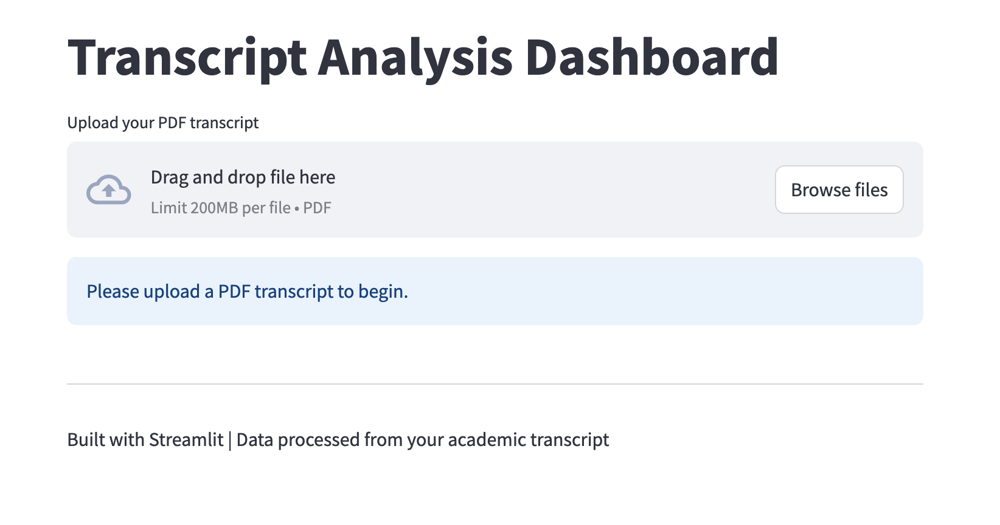
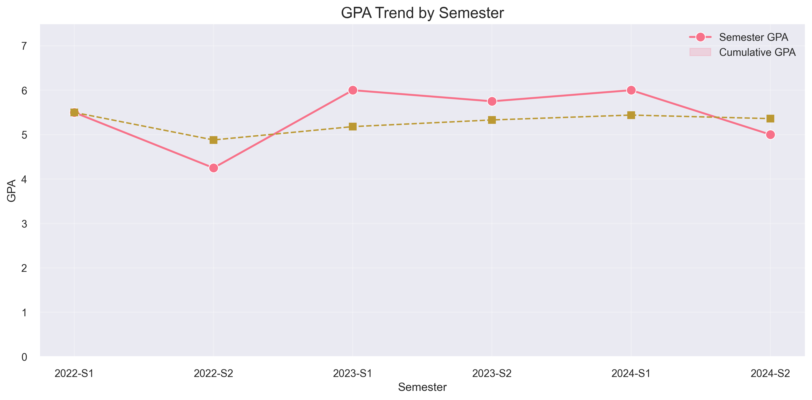
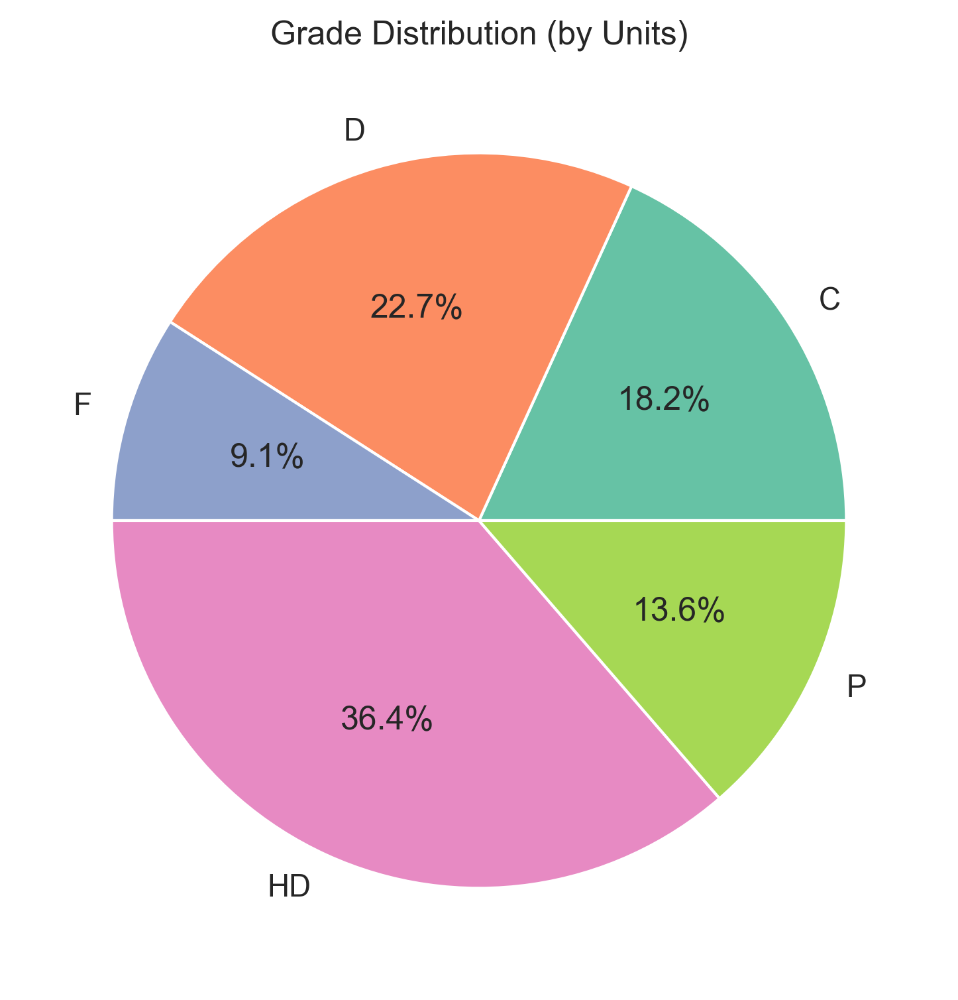
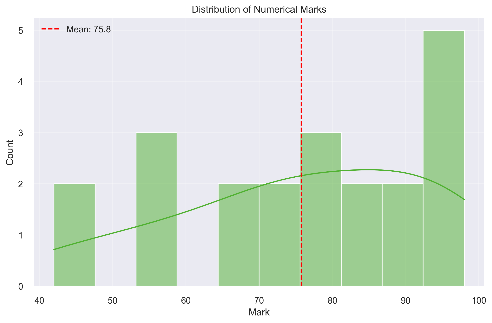
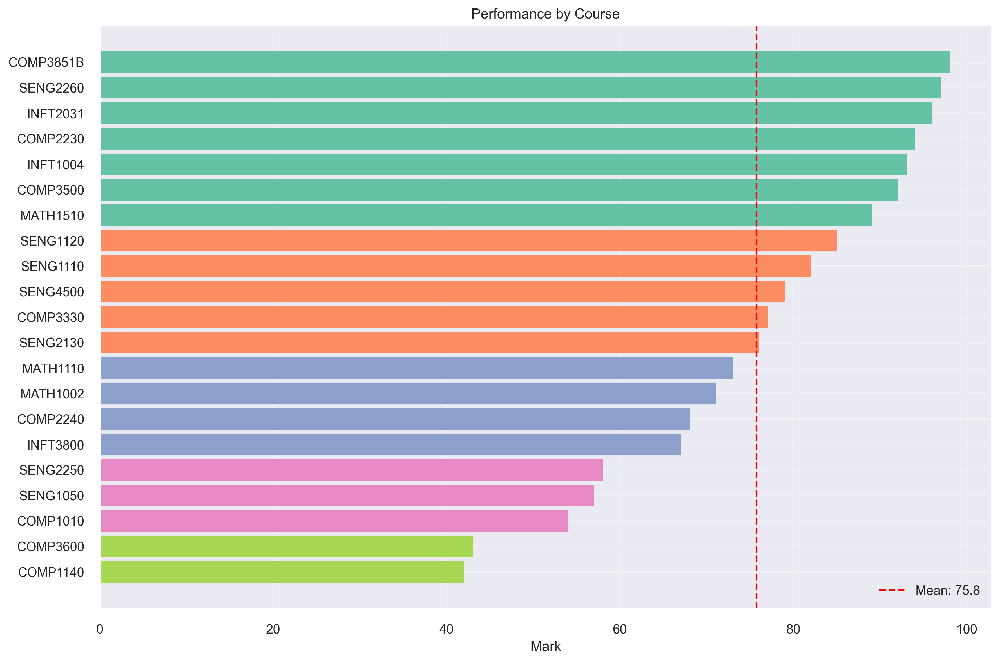
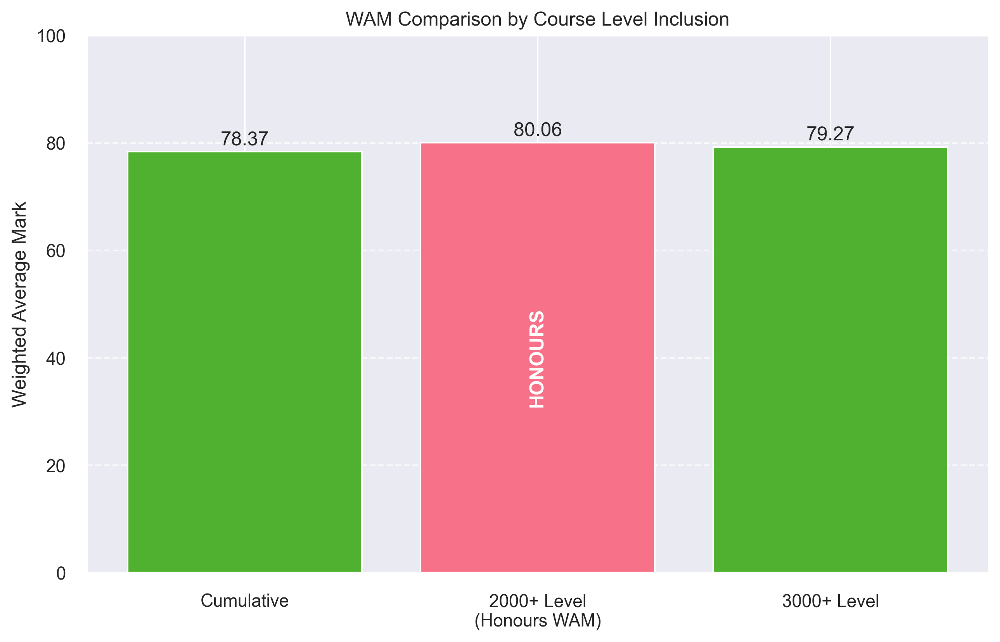
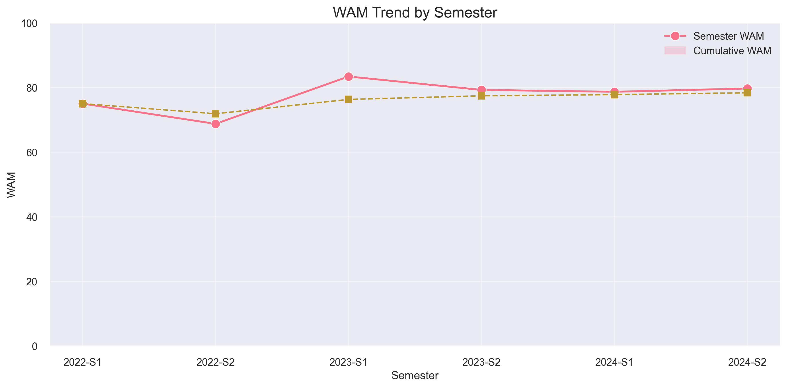
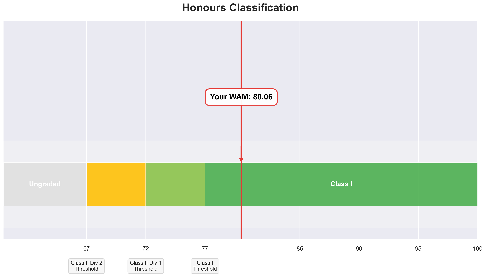

<p align="center">
  
</p>

<p align="center">
  <a href="https://github.com/swazau/UON_GPA/blob/main/LICENSE"></a>
  <a href="https://www.python.org/downloads/"></a>
  <a href="https://github.com/swazau/UON_GPA/blob/main/CONTRIBUTING.md"></a>
  <br>
  <a href="https://github.com/swazau/UON_GPA/stargazers"></a>
  <a href="https://github.com/swazau/UON_GPA/network/members"></a>
  <a href="https://github.com/swazau/UON_GPA/issues"></a>
  <a href="https://makeapullrequest.com"></a>
</p>

A Python tool for visualising academic performance and calculating GPAs and WAMs from PDF transcripts (both official and unofficial), designed for the University of Newcastle grading system.

## Features

### Interactive Web Interface
- 🚀 Upload and analyse your transcripts through a user-friendly Streamlit interface
- 📊 View all visualisations in one place
- 📄 Process UON transcripts directly from PDF files
- 📱 Mobile-friendly design

### GPA Calculator
- 📊 Calculate overall GPA using a 7-point scale
- 📈 Visualise GPA trends across semesters
- 🥧 Generate grade distribution charts
- 📉 Analyse mark distributions
- 📋 View detailed course performance breakdowns

### WAM Calculator
- 🎓 Calculate Honours WAM by default (2000+ level courses)
- 📊 Additional WAM calculations for reference:
  - Cumulative WAM (all courses)
  - Level-specific WAM (e.g., 3000+ level courses)
- 📈 Track WAM trends across semesters
- 📉 View mark distribution with WAM thresholds
- 📋 See detailed course-by-course breakdown

## What is WAM?

A Weighted Average Mark (WAM) is the average mark achieved across all completed units in a program, weighted according to unit value and academic level. Unlike the GPA, which uses grade points, WAM uses the actual percentage marks and applies weighting based on course levels.

The Honours WAM (used for determining honours classification) is calculated using only 2000+ level courses with the following weightings:
- 2000 level courses: Weight = 2
- 3000 level courses: Weight = 3
- 4000/5000/6000 level courses: Weight = 4

## Screenshots

### Dashboard



### GPA Trend


### Grade Distribution


### Mark Distribution


### Course Performance


### WAM Comparison


### WAM Trend


### WAM Honours Threshold


## Installation

### Prerequisites
- Python 3.8 or higher
- `pip` (Python package installer)

### Option 1: Quick Setup (Recommended)

#### On Windows:
```bash
git clone https://github.com/swazau/UON_GPA.git
cd UON_GPA
setup.bat
```

#### On macOS/Linux:
```bash
git clone https://github.com/swazau/UON_GPA.git
cd UON_GPA
chmod +x setup.sh && ./setup.sh
```

### Option 2: Manual Setup
```bash
git clone https://github.com/swazau/UON_GPA.git
cd UON_GPA
python -m venv venv

# Activate the virtual environment
# On Windows:
venv\Scripts\activate
# On macOS/Linux:
source venv/bin/activate

# Install dependencies
pip install -r requirements.txt
```

## Running the Application

To run the interactive Streamlit dashboard:

```bash
# Make sure your virtual environment is activated
streamlit run Dashboard.py
```

The web application will automatically open in your default browser. If it doesn't, you can access it at http://localhost:8501.

### Using the Dashboard
1. Upload your PDF transcript using the file uploader
2. The app will automatically process your transcript and display:
   - GPA calculations and visualisations
   - WAM calculations and visualisations
   - Course performance details

## Grade Scales

### GPA Scale
| Grade | Points | Description        |
|-------|---------|--------------------|
| HD    | 7       | High Distinction   |
| D     | 6       | Distinction        |
| C     | 5       | Credit             |
| P     | 4       | Pass               |
| F     | 0       | Fail               |

### WAM Mark Values
| Grade | Mark Range | Value for WAM |
|-------|------------|---------------|
| HD, D, C, P | 50-100 | Actual percentage mark |
| F | 45-49 | Actual percentage mark |
| F | 0-44 | Fixed value of 44 |
| UP | N/A | Fixed value of 58 |

## Contributing

Contributions are welcome! Please feel free to submit a Pull Request.

## License

This project is licensed under the MIT License - see the LICENSE file for details.

## Acknowledgments
- [University of Newcastle GPA Calculator](https://www.newcastle.edu.au/current-students/study-essentials/assessment-and-exams/results/gpa-calculator)
- [University of Newcastle WAM Calculation Guideline](https://policies.newcastle.edu.au/document/view-current.php?id=3)
- [DataCraftsmanAU](https://github.com/DataCraftsmanAU) for the Streamlit interface
- [Pandas](https://pandas.pydata.org/) for data manipulation
- [Plotly](https://plotly.com/) for interactive visualisations
- [Streamlit](https://streamlit.io/) for the web interface
- [PDFPlumber](https://github.com/jsvine/pdfplumber) for PDF processing